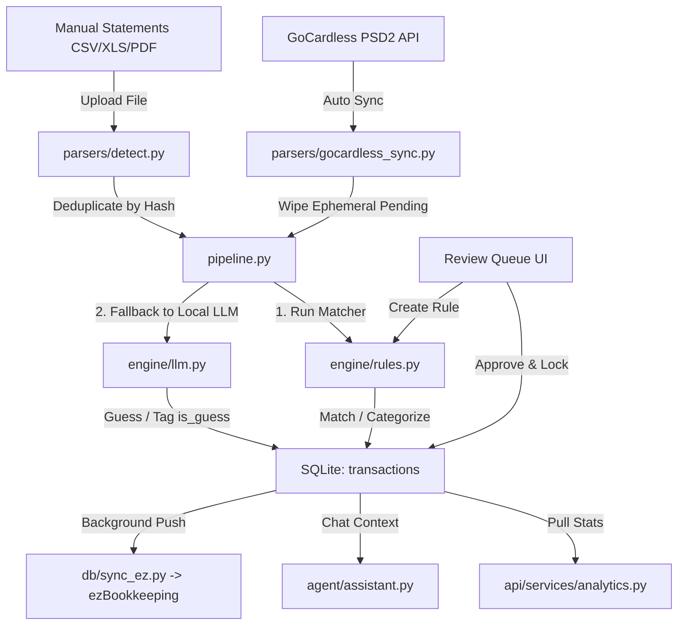

# Personal_Finz System Architecture

Personal_Finz is a privacy-first, local-sovereign, multi-currency fintech platform designed to aggregate, parse, categorize, and analyze financial transactions offline. It uses a hybrid ingestion model supporting direct bank API syncs alongside manual statement parsing, backing everything with SQLite and local LLM intelligence.

---

## Architecture Overview

---

## 1. Storage & Database Schema (Local Sovereignty)

All state is persisted locally in `~/.personalfinz/data.db`. The database consists of three primary tables:
- **`transactions`**: The master ledger containing normalized transactions. Key flags include:
  - `is_guess` (Boolean): Identifies if the category was guessed by the local LLM.
  - `is_pinned` (Boolean): Set to `1` when the user reviews and locks the categorization, protecting it from overwrite.
  - `is_ignored` (Boolean): Set to `1` to exclude specific transactions (such as internal transfer churn) from analytics.
  - `hash` (Unique): Generated for manual statement entries (`sha256(date + description + amount)`) to prevent duplication.
  - `external_sync_id` (Unique): Maps GoCardless API ids or fallback hashes.
  - `status` (`PENDING` or `SETTLED`): Indicates transaction settlement state.
- **`rules`**: Stores user-defined and auto-generated merchant categorization rules with priorities, match patterns (substring, regex, exact), and amount bounds.
- **`sync_logs`**: Logs synchronization events for rate limiting and auditing.

---

## 2. Ingestion Paths

### Path A: Automated Bank Feeds (GoCardless PSD2 API)
Pulls transactions directly from European banking institutions.
- **Rate Limit Safeguard**: The system logs successful runs. If a sync is triggered, the engine queries the `sync_logs` table. If the account has had **4 successful syncs in the last 24 hours**, the request is gracefully skipped, logging a `SKIPPED` status to protect the user's API credentials from 429 locks.
- **Ephemeral Pending Sweeping**: To ensure real-time pending items reflect correctly without duplicating, the pipeline deletes all existing `status = 'PENDING'` records for the specific account before inserting the fresh batch.
- **Deterministic ID Fallback**: In cases where traditional banks leave the `transactionId` field empty in the PSD2 payload, the parser falls back to generating a composite hash: `gcl_fallback_ + sha256(booking_date + amount + remittance_info)[:16]` to ensure database integrity and avoid multiple NULL conflicts.

### Path B: Manual Statement Uploads (CSV / XLS / PDF)
Supports manual file drops of statements that do not have API connections (e.g. HDFC India).
- **Auto-Detection**: `parsers/detect.py` evaluates header rows and structures to automatically route files to HDFC, Revolut, or PDF parsers.
- **Manual Hash Deduplication**: Transactions are assigned a SHA-256 hash of their primary attributes. SQLite imports use `ON CONFLICT DO NOTHING` to ensure that uploading overlapping or full-month statements never results in duplicate records.

---

## 3. Categorization & Rules Engine

The system follows a strict **Rules > LLM** hierarchy to maintain precision and minimize local compute.

1. **Exact, Substring, and Regex Matchers**: The transaction description is normalized and compared against the SQLite `rules` table, filtered by priority and amount thresholds.
2. **Ollama Fallback**: If no rules match, the transaction description and amount are forwarded to a local Ollama client (`qwen3.5:4b`). The LLM returns a category and the row is saved with `is_guess = 1`.
3. **Three-tiered Spending Flexibility**: In order to calculate financial health metrics, categories are mapped into three distinct layers:
   - **`Fixed`**: Essential survival costs (Rent, Utilities, Telephone, Internet, Insurance, Tax).
   - **`Flexible`**: Dynamic needs that can be trimmed (Food, Drink, Clothing, Transit, Travel).
   - **`Discretionary`**: Lifestyle wants (Movies, Shows, Subscription, Toys & Games, Party).

---

## 4. User Review & Rule Propagation

Uncategorized transactions and LLM-guesses populate the **Review Queue** UI.
- When a user selects a transaction, edits its parameters, and approves it:
  - The transaction is updated, `is_guess` is reset to `0`, and `is_pinned` is set to `1` (locked).
- If the user opts to **Create Rule** during approval:
  - A matching rule is saved in the database.
  - The engine automatically triggers a background propagation sweep: `apply_rules_to_unpinned_transactions()` runs the new rule against all other unpinned transactions in the database, automatically updating matches and removing them from the review queue.

---

## 5. Analytics & Synchronization

- **Multi-currency Standardization**: The analytics engine converts Indian Rupee (INR) transactions to Euro (EUR) on-the-fly using a configured exchange rate (`EUR_INR_RATE`, default `90.0`) to present unified Net Worth, Savings Rate, and FIRE metrics.
- **ezBookkeeping Push**: Any transactions that are settled and pinned are pushed in the background to a self-hosted ezBookkeeping instance via API.